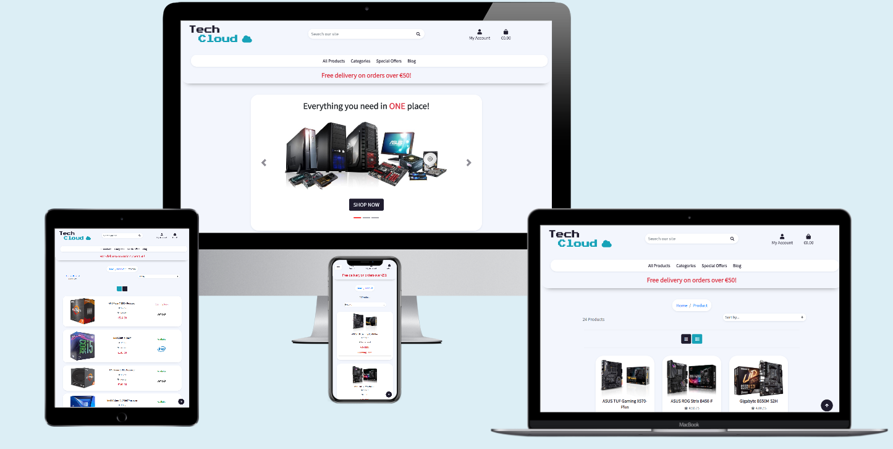
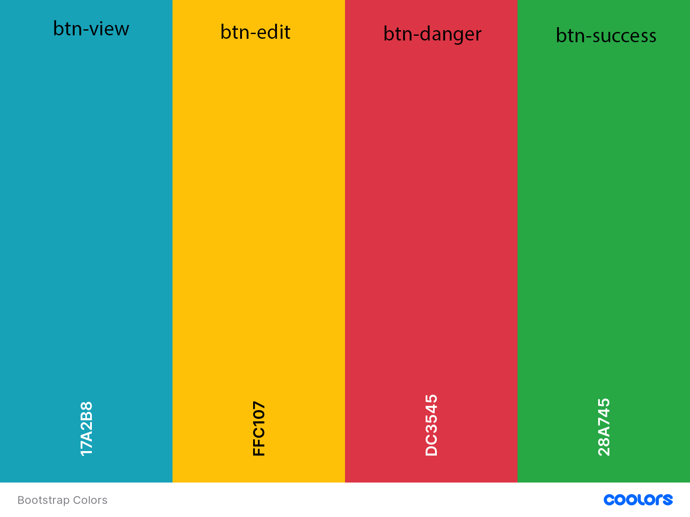

# Tech Cloud

Welcome to Tech Cloud.

Tech Cloud is a fully responsive, custom website full stack-website, designed and built according to the wishes and needs of the users.

It allows all users to purchase products, subscribe to the newsletter and access the blog,
allows registered users to post and like the posts of other users, 
while giving the business owner complete control over the content of the site and advertising and promoting a particular product.

## Table Of Contents

- [Tech Cloud](#tech-cloud)
  * [Website Purpose:](#website-purpose-)
  * [UX](#ux)
    + [Goals](#goals)
      - [Shooper Goals](#shooper-goals)
      - [User Goals](#user-goals)
      - [Bussines Goals](#bussines-goals)
    + [User Stories](#user-stories)
      - [Shopper Stories](#shopper-stories)
      - [User Stories](#user-stories-1)
      - [Bussines Stories](#bussines-stories)
    + [Design Choices](#design-choices)
      - [Colors](#colors)
      - [Typography](#typography)
      - [Icons](#icons)
      - [Wireframes](#wireframes)
      - [Diagrams](#diagrams)
  * [Features](#features)
    + [Existing Features](#existing-features)
    + [Features Left to Implement](#features-left-to-implement)
  * [Technologies Used](#technologies-used)
  * [Testing](#testing)
  * [Deployment](#deployment)
  * [Credit](#credit)
    + [Content](#content)
    + [Media](#media)
  * [Disclaimer](#disclaimer)
    + [Acknowledgements](#acknowledgements)

## Website Purpose:

Tech Cloud is an online web store intended for small and medium-sized businesses that sells a group of products related with their purpose.
With its design, Tech Cloud tries to provide all its users with comfortable use with a set of features that will be explained in this document.

## UX

### Goals

- The central target audience for Tech Cloud are all people who want / can buy a certain piece of hardware, want read or comment on a certain product.

#### Shooper Goals

- Learn about the products on offer and the benefit they give.
- Purchase an item.
- Subscribe to newsletter.
- Read about product.

#### User Goals

- Register Account.
- Save my information for delivery.
- Subscribe to newsletter.
- Read about product.
- Write/comment about product.

#### Bussines Goals

- Advertise product and special offers
- Offer user and shoopers pleasant time using site
- Easy view, add, edit and delete product and related content.

### User Stories

#### Shopper Stories

- As a shopper i want to be able to view a list of products so that i can select some to purchase.

- As a shopper i want to be able to change layout od displayed items so that i can get different view on products.

- As a shopper i want to be able to visit the manufacturer website so that i can read more about product.

- As a shopper i want to be able to quickly identify deals, special offers and promotions so that i can take advantage of special savings on products i'd like to purchase.

- As a shopper i want to be able to see product availability so I can make purchasing decisions.

- As a shopper i want to be able to sort a list of products so that i can easily indentify the best rated, best priced and categororically sorted products.

- As a shopper i want to be able to sort a specific category of products so that i can find the best priced or best rated product in a specific category, or sort products by brand.

- As a shopper i want to be able to search for a product by name or description so that i can find a specific product i'd like to purchase.

- As a shopper i want to be able to subscribe to newsletter so that i can get lattest news and promotions.

- As a shopper i want to be able to easily see what i've searched for and the number of results so that i can quickly decide whether the product i want is available.

- As a shopper i want to be able to read product specifications and detail so that i can deside if this product suit my needs.

- As a shopper i want to be able to easily navigate to additional information about product so that i can read more about product.

- As a shopper i want to be able to easily indentify product brand and supported hardware so that i can deside about purchase.

- As a shopper i want to be able to indentify my current position on the page so that i can easily navigate through the page.

- As a shopper i want to be able to read about new market products so that i can be informed about product and make purchasing decisions.

- As a shopper i want to be able to easily view the total of my purchases at any time so that i can avoid spending too much.

- As a shopper i want to be able to view items in my bag to be purchased so that i can identify the total cost of my purchase and all items i will receive.

- As a shopper i want to be able to adjust the quantity of individual items in my bag so that i can easily make changes to my purchase before checkout.

- As a shopper i want to be able to easily enter my payment information so that i can check out quickly without any problems.

- As a shopper i want to be able to feel my personal and payment information is safe and secure so that i can verify that i havent't make any mistakes.

- As a shopper i want to be able to view an order confirmation after checking out so that i can keep the confirmation of what i've purchased for my records.

- As a shopper i want to be able to recive an email confirmation after checking out so that i can keep the confirmation of what i've purchased for my records.

- As a shopper i want to be able to receive confirmation by email after subscribing to the newsletter so i can be sure that I will receive the latest news and promotions.

- As a shopper i want to be able to identify that site is processing my inqueries so that i can expect product feedback.

#### User Stories

- As a user i want to be able to easily register for an account so that i can have a personal account and be able to view my profile.

- As a user i want to be able to easily login or logout so that i can access my personal account information.

- As a user i want to be able to easily recover my password in case i forget it so that i can recover access to my account.

- As a user i want to be able to receive an email confirmation after registering so that i can verify that my account registration was successful.

- As a user i want to be able to have a personailzed user profile so that i can view my personal order history and order confirmations, and save my payment information.

- As a user i want to be able to read and comment about a product so that i can be informed and inform others about product.

#### Bussines Stories

- As a business owner i want to be able to create new product so that i can add new item to my store.

- As a business owner i want to be able to create and setup new product brand, category, key features, features, specifications and specs so that i can use them when adding product.

- As a business owner i want to be able to easily access to product managment so that i can modify products on different way.

- As a business owner i want to be able to change item availability so that i can start/stop sale of product.

- As a business owner i want to be able to display special offers and promotions so that i can increase product sale.

- As a business owner i want to be able to edit/update a product so that i can change product price, descriptions, image, and other product criteria.

- As a business owner i want to be able to delete a record so that i can remove item that are no longer for sale.

### Design Choices

After finishing the home page and using only the bootstrap color for the page,
I was not satisfied with the look and feel that the page leaves on me as a developer,
so I found inspiration in [this](https://uxplanet.org/top-ui-ux-design-inspiration-138-90703cf88472 ) article 
and the idea of ​​how to continue in [this](https://codepen.io/aybukeceylan/pen/OJRNbZp) codepen 
from which I extracted App color, main color with shadows and white as a background for texts and images.
The site uses pronounced rounded edges, white backgrounds and shadows to get a clean and light look.
The design of this site is simple but catchy. It ensures that the products are well represented,
call to action buttons have consistency and it is easy to read and navigate as a whole.

#### Colors

- Main Site Colors
    - 

- Helping bootstrap colors
    - 

#### Typography

- Logo Font
    - I chose [Press Start 2P](https://fonts.google.com/specimen/Press+Start+2P?preview.text_type=custom#standard-styles) for the logo font because of the pixalization and it fits well with the theme of the page.

- Main Font
    - [Noto Sans JP](https://fonts.google.com/specimen/Press+Start+2P?preview.text_type=custom#standard-styles) chosen for the readability of the text especially on smaller screens.

#### Icons

- The icons used in this project are provided by [Font Awesome](https://fontawesome.com/).

- All icons used were chosen for their obvious meaning and purpose so that they can be understood by everyone.

#### Wireframes

- These wireframes were created using [Balsamiq](https://balsamiq.com/) during the Scope Plane part of the design and planning process for this project.

- Wireframes for this project can be found [here](readme_files/wireframes/wireframes.pdf).

#### Diagrams

- Data diagram for this project can be found [here](readme_files/diagrams/tech-cloud-data.pdf).

## Features

### Existing Features

- Navigation bar

    - The Navbar is fixed and contain Search Bar, User Account and Shooping Bag so it is always available to the user.
    - Allows all users to select the content they want to view by simply clicking them, this also collapses into a toggle on mobile devices to.

- Home page

    - Contain Carousel with three item links to navigate user to some additional features

        - Shop How - which will display all products from the database when the button is pressed.

        - Read More - which will transfer the user to the site blog.

        - Subscribe - which will transfer the user to the newsletter subscription form.

    - Categories

        - Below Carousel are all product categories that rotate when the cursor hovers and
          get a shadow letting the user know that something will happen when they click.

- Big Buttons

    - The site is adorned with large buttons on both small and large screens. Easy to spot and stand out against a white background. 
      The same form is used throughout the page, except for the buttons for adding, editing and deleting content.

- Hover effects

    - All the clicking buttons on the hover change color and shadow, letting the user know that something will happen with their action.

- Breadcrumb

    - Breadcrumbs are located on the product pages, letting the user know exactly where they are on the site and by clicking on a specific link,
      they search for and filter certain products.

- Grid and List layout

    - By pressing the button, the user can choose how the products will be displayed. 
      The layout change buttons are located on the product pages and on the setup pages.

    - Product list layout is available only for Medium screens and up.
    - On setup pages is available for all screens.

- Delete Modals

    - For each delete button, there is a modal as a content protection that will ask the user for confirmation to delete when the button is pressed.

- Product availability

    - Clean and clear display of product availability, if the product is not available the user is offered the option
      to subscribe to the newsletter to be notified when the product becomes available.

- Sticky Product Image

    - On the product detail page product image container have position sticky so that the image is available to the user while reading the content on the right.

- Newsletter

    - All users have the opportunity to subscribe to the newsletter and receive offers, promotions and the latest information from the site.

- Blog

    - Allows users to read published content and the latest news while allowing registered users to publish and like content and posts.

- Scroll to top buttons

    - It is found on all pages that require such a feature.

- Footer with social links and contact information

    - It is located on all pages at the bottom allowing the user contact information and social link.

- Brands logos

    - The brand logo is located on the product page, on product list layout and clicking on the brand takes the user to the official website of the manufacturer.

- Left and right promotion banners

    - On product detail page left and right are side/promotion banners allowing the business owner to promote a particular product.
      Promotion banners and brand side banners are linked and the owner can place side banners when adding a brand,
      later if a certain product from the same brand has a promotion, side banners can be overwrite with promotion banners
      offering the business owner opportunity to promote only one specific product.
      Later when promotion is finish it is enough to just remove the promotional banners from the product and
      if the brand has a side banner set the side banner will take place back or not if side banner is not set up.

### Features Left to Implement

- Similar products

    - Display a list of similar products when the product details page opens.

- Social Accounts

    - Allow the user to register via social networks.

- Search and filtering
 
    - Better product search and filtering.

## Technologies Used

- This project uses [HTML](https://www.w3.org/TR/html52/), [CSS](https://www.w3.org/Style/CSS/Overview.en.html), [JavaScript](https://developer.mozilla.org/en/JavaScript) and [Python](https://www.python.org/) programming languages.
- [Django](https://www.djangoproject.com/) as python web framework.
- [Stripe](https://stripe.com) as payment platform to validate and accept credit card payments securely.
- [AWS S3 Bucket](https://aws.amazon.com/) to store images entered into the database.
- [Boto3](https://boto3.amazonaws.com/v1/documentation/api/latest/index.html) configuration and management of AWS S3.
- [Django Crispy Forms](https://django-crispy-forms.readthedocs.io/en/latest/) to style django forms.
- [Django Storages](https://django-storages.readthedocs.io/en/latest/) a collection of custom storage backends.
- [Gunicorn](https://pypi.org/project/gunicorn/) in deployment of the Django project to heroku.
- [Pillow](https://pillow.readthedocs.io/en/stable/) imaging library to aid in processing image files to store in database.
- [Psycopg2](https://pypi.org/project/psycopg2/) as PostgreSQL database.
- [SQlite3](https://www.sqlite.org/index.html) for development database, provided by django.
- [PIP](https://pip.pypa.io/en/stable/installing/) for installation of tools needed in this project.
- [Git](https://gist.github.com/derhuerst/1b15ff4652a867391f03) to handle version control.
- [GitHub](https://github.com/) to store and share all project code remotely.
- [Gitpod](https://www.gitpod.io/) as a local IDE, 
- [Photoshop](www.adobe.com/Photoshop) to edit, crop and save images.
- [Heroku](https://www.heroku.com/home) for deployment.
- [Balsamiq](https://balsamiq.com/) to create the wireframes for this project.
- [JQuery](https://jquery.com) to simplify DOM manipulation.
- [Bootstrap](https://www.bootstrapcdn.com/) make the website responsive easily.
- [FontAwesome](https://www.bootstrapcdn.com/fontawesome/) to provide icons.
- [Google Fonts](https://fonts.google.com/) to style the website fonts.

## Testing

- Testing of site can be find [here](testing.md).

## Deployment

- How to **Deploy** this project on your local IDE. [Find here](deployment.md).

## Credit

- Major inspiration and quite a bit of code was taken from Code Institute's Boutique Ado project by Chris.
  Where code was used fully or used partly has been written down in comments in the code.

### Content

- All content for this website are download from [Amazon](https://amazon.com/).

### Media

- Product Media Files are download from [Amazon](https://amazon.com/).
- Categories images are download from [Flaticon](https://www.flaticon.com/packs/computer-hardware-57?word=computer%20hardware).
    - 
Icons made by <a href="https://www.flaticon.com/authors/dighital" title="Dighital">Dighital</a> from <a href="https://www.flaticon.com/" title="Flaticon">www.flaticon.com</a>

- All Brand Images are download from [BrandEPS](https://brandeps.com/logo/Computer-and-IT).

## Disclaimer

- I do not own any of the photos or logos used across the site. Please contact me immediately in case of any copyright issue and I will happily remove anything.

- This project is for educational purposes only.

### Acknowledgements

To my girlfriend who was my biggest helper, the biggest critic, the voice of common sense in some difficult moments during the making of this project.

I'd like to thank my mentor in Code Institute Precious Ijege who had helping me through this whole year.

All people, including family, friends, and colleagues who have tested the application on their real devices, reporting to me about any usability issues and giving improvement tips to improve the usability.

To all of the Code Institute Slack community for the help and answers for my issues.

- Go [Back to Top](#).