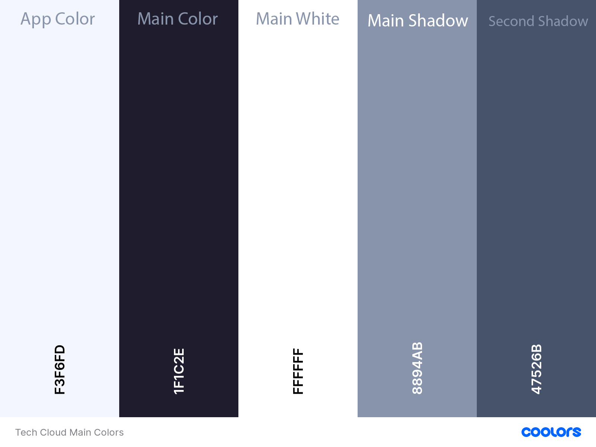

# Tech Cloud

Welcome to Tech Cloud.

Tech Cloud is a fully responsive, custom website full stack-website, designed and built according to the wishes and needs of the users.

It allows all users to purchase products, subscribe to the newsletter and access the blog,
allows registered users to post and like the posts of other users, 
while giving the business owner complete control over the content of the site and advertising and promoting a particular product.

## Website Purpose:

Tech Cloud is an online web store intended for small and medium-sized businesses that sells a group of products related with their purpose.
With its design, Tech Cloud tries to provide all its users with comfortable use with a set of features that will be explained in this document.

## UX

### Goals

- The central target audience for Tech Cloud are all people who want / can buy a certain piece of hardware, want read or comment on a certain product.

#### Shooper Goals

- Learn about the products on offer and the benefit they give.
- Purchase an item.
- Subscribe to newsletter.
- Read about product.

#### User Goals

- Register Account.
- Save my information for delivery.
- Subscribe to newsletter.
- Read about product.
- Write/comment about product.

#### Bussines Goals

- Advertise product and special offers
- Offer user and shoopers pleasant time using site
- Easy view, add, edit and delete product and related content.

### User Stories

#### Shopper Stories

- As a shopper i want to be able to view a list of products so that i can select some to purchase.

- As a shopper i want to be able to change layout od displayed items so that i can get different view on products.

- As a shopper i want to be able to visit the manufacter website so that i can read more about product.

- As a shopper i want to be able to quickly identify deals, special offers and promotions so that i can take advantage of special savings on products i'd like to purchase.

- As a shopper i want to be able to see product availability so I can make purchasing decisions.

- As a shopper i want to be able to sort a list of products so that i can easily indentify the best rated, best priced and categororically sorted products.

- As a shopper i want to be able to sort a specific category of products so that i can find the best priced or best rated product in a specific category, or sort products by brand.

- As a shopper i want to be able to search for a product by name or description so that i can find a specific product i'd like to purchase.

- As a shopper i want to be able to subscribe to newsletter so that i can get lattest news and promotions.

- As a shopper i want to be able to easily see what i've searched for and the number of results so that i can quickly decide whether the product i want is available.

- As a shopper i want to be able to read product specifications and detail so that i can deside if this product suit my needs.

- As a shopper i want to be able to easily navigate to additional information about product so that i can read more about product.

- As a shopper i want to be able to easily indentify product brand and supported hardware so that i can deside about purchase.

- As a shopper i want to be able to indentify my current position on the page so that i can easily navigate through the page.

- As a shopper i want to be able to read about new market products so that i can be informed about product and make purchasing decisions.

- As a shopper i want to be able to easily view the total of my purchases at any time so that i can avoid spending too much.

- As a shopper i want to be able to view items in my bag to be purchased so that i can identify the total cost of my purchase and all items i will receive.

- As a shopper i want to be able to adjust the quantity of individual items in my bag so that i can easily make changes to my purchase before checkout.

- As a shopper i want to be able to easily enter my payment information so that i can check out quickly without any problems.

- As a shopper i want to be able to feel my personal and payment information is safe and secure so that i can verify that i havent't make any mistakes.

- As a shopper i want to be able to view an order confirmation after checking out so that i can keep the confirmation of what i've purchased for my records.

- As a shopper i want to be able to recive an email confirmation after checking out so that i can keep the confirmation of what i've purchased for my records.

- As a shopper i want to be able to receive confirmation by email after subscribing to the newsletter so i can be sure that I will receive the latest news and promotions.

- As a shopper i want to be able to identify that site is processing my inqueries so that i can expect product feedback.

#### User Stories

- As a user i want to be able to easily register for an account so that i can have a personal account and be able to view my profile.

- As a user i want to be able to easily login or logout so that i can access my personal account information.

- As a user i want to be able to easily recover my password in case i forget it so that i can recover access to my account.

- As a user i want to be able to receive an email confirmation after registering so that i can verify that my account registration was successful.

- As a user i want to be able to have a personailzed user profile so that i can view my personal order history and order confirmations, and save my payment information.

- As a user i want to be able to read and comment about a product so that i can be informed and inform others about product.

#### Bussines Stories

- As a business owner i want to be able to create new product so that i can add new item to my store.

- As a business owner i want to be able to create and setup new product brand, category, key features, features, specifications and specs so that i can use them when adding product.

- As a business owner i want to be able to easily access to product managment so that i can modify products on different way.

- As a business owner i want to be able to change item availability so that i can start/stop sale of product.

- As a business owner i want to be able to display special offers and promotions so that i can increase product sale.

- As a business owner i want to be able to edit/update a product so that i can change product price, descriptions, image, and other product criteria.

- As a business owner i want to be able to delete a record so that i can remove item that are no longer for sale.

#### Design Choices

After finishing the home page and using only the bootstrap color for the page,
I was not satisfied with the look and feel that the page leaves on me as a developer,
so I found inspiration in THIS article and the idea of ​​how to continue in THIS codepen 
from which I extracted App color, main color with shadows and white as a background for texts and images.
The site uses pronounced rounded edges, white backgrounds and shadows to get a clean and light look.
The design of this site is simple but catchy. It ensures that the products are well represented,
call to action buttons have consistency and it is easy to read and navigate as a whole.

#### Colors

- Main Site Colors
    - 

- Helping bootstrap colors
    - 

#### Typography

- Logo Font
    - I chose [Press Start 2P](https://fonts.google.com/specimen/Press+Start+2P?preview.text_type=custom#standard-styles) for the logo font because of the pixalization and it fits well with the theme of the page.

- Main Font
    - [Noto Sans JP](https://fonts.google.com/specimen/Press+Start+2P?preview.text_type=custom#standard-styles) chosen for the readability of the text especially on smaller screens.

#### Icons

- The icons used in this project are provided by [Font Awesome](https://fontawesome.com/).

- All icons used were chosen for their obvious meaning and purpose so that they can be understood by everyone.

#### Wireframes

- These wireframes were created using [Balsamiq](https://balsamiq.com/) during the Scope Plane part of the design and planning process for this project.

- Wireframes for this project can be found [here](readme_files/wireframes/wireframes.pdf).

#### Diagrams

- Data diagram for this project can be found [here](readme_files/diagrams/tech-cloud-data.pdf).

## Features

### Existing Features

- Navigation bar

    - The Navbar is fixed and contain Search Bar, User Account and Shooping Bag so it is always available to the user.
    - Allows all users to select the content they want to view by simply clicking them, this also collapses into a toggle on mobile devices to.

- Home page

    - Contain Carousel with three item links to navigate user to some additional features

        - Shop How - which will display all products from the database when the button is pressed.

        - Read More - which will transfer the user to the site blog.

        - Subscribe - which will transfer the user to the newsletter subscription form.

    - Categories

        - Below Carousel are all product categories that rotate when the cursor hovers and
          get a shadow letting the user know that something will happen when they click.

- Big Buttons

    - The site is adorned with large buttons on both small and large screens. Easy to spot and stand out against a white background. 
      The same form is used throughout the page, except for the buttons for adding, editing and deleting content.

- Hover effects

    - All the clicking buttons on the hover change color and shadow, letting the user know that something will happen with their action.

- Breadcrumb

    - Breadcrumbs are located on the product pages, letting the user know exactly where they are on the site and by clicking on a specific link,
      they search for and filter certain products.

- Grid and List layout

    - By pressing the button, the user can choose how the products will be displayed. 
      The layout change buttons are located on the product pages and on the setup pages.

    - Product list layout is available only for Medium screens and up.
    - On setup pages is available for all screens.

- Delete Modals

    - For each delete button, there is a modal as a content protection that will ask the user for confirmation to delete when the button is pressed.

- Product availability

    - Clean and clear display of product availability, if the product is not available the user is offered the option
      to subscribe to the newsletter to be notified when the product becomes available.

- Sticky Product Image

    - On the product detail page product image container have position sticky so that the image is available to the user while reading the content on the right.

- Newsletter

    - All users have the opportunity to subscribe to the newsletter and receive offers, promotions and the latest information from the site.

- Blog

    - Allows users to read published content and the latest news while allowing registered users to publish and like content and posts.

- Scroll to top buttons

    - It is found on all pages that require such a feature.

- Footer with social links and contact information

    - It is located on all pages at the bottom allowing the user contact information and social link.

- Brands logos

    - The brand logo is located on the product page, on product list layout and clicking on the brand takes the user to the official website of the manufacturer.

- Left and right promotion banners

    - On product detail page left and right are side/promotion banners allowing the business owner to promote a particular product.
      Promotion banners and brand side banners are linked and the owner can place side banners when adding a brand,
      later if a certain product from the same brand has a promotion, side banners can be overwrite with promotion banners
      offering the business owner opportunity to promote only one specific product.
      Later when promotion is finish it is enough to just remove the promotional banners from the product and
      if the brand has a side banner set the side banner will take place back or not if side banner is not set up.

### Features Left to Implement

- Similar products

    - Display a list of similar products when the product details page opens.

- Social Accounts

    - Allow the user to register via social networks.

- Search and filtering
 
    - Better product search and filtering.

## Technologies Used

- This project uses [HTML](https://www.w3.org/TR/html52/), [CSS](https://www.w3.org/Style/CSS/Overview.en.html), [JavaScript](https://developer.mozilla.org/en/JavaScript) and [Python](https://www.python.org/) programming languages.
- [Django](https://www.djangoproject.com/) as python web framework.
- [Stripe](https://stripe.com) as payment platform to validate and accept credit card payments securely.
- [AWS S3 Bucket](https://aws.amazon.com/) to store images entered into the database.
- [Boto3](https://boto3.amazonaws.com/v1/documentation/api/latest/index.html) configuration and management of AWS S3.
- [Django Crispy Forms](https://django-crispy-forms.readthedocs.io/en/latest/) to style django forms.
- [Django Storages](https://django-storages.readthedocs.io/en/latest/) a collection of custom storage backends.
- [Gunicorn](https://pypi.org/project/gunicorn/) in deployment of the Django project to heroku.
- [Pillow](https://pillow.readthedocs.io/en/stable/) imaging library to aid in processing image files to store in database.
- [Psycopg2](https://pypi.org/project/psycopg2/) as PostgreSQL database.
- [SQlite3](https://www.sqlite.org/index.html) for development database, provided by django.
- [PIP](https://pip.pypa.io/en/stable/installing/) for installation of tools needed in this project.
- [Git](https://gist.github.com/derhuerst/1b15ff4652a867391f03) to handle version control.
- [GitHub](https://github.com/) to store and share all project code remotely.
- [Gitpod](https://www.gitpod.io/) as a local IDE, 
- [Photoshop](www.adobe.com/Photoshop) to edit, crop and save images.
- [Heroku](https://www.heroku.com/home) for deployment.
- [Balsamiq](https://balsamiq.com/) to create the wireframes for this project.
- [JQuery](https://jquery.com) to simplify DOM manipulation.
- [Bootstrap](https://www.bootstrapcdn.com/) make the website responsive easily.
- [FontAwesome](https://www.bootstrapcdn.com/fontawesome/) to provide icons.
- [Google Fonts](https://fonts.google.com/) to style the website fonts.

## Testing

## Deployment

- This development tutorial will work with the assumption that:
  - [Gitpod](https://www.gitpod.io/) will be used as a local IDE,
  - [GitHub](https://github.com/) as local storage for your code,
  - [Gmail](https://accounts.google.com/) as email service provider,
  - [Stripe](https://stripe.com/) as payment service provider,
  - [Heroku](https://www.heroku.com/home) as your remote storage service and deployment platform,
  - [AWS S3 Bucket](https://aws.amazon.com/) as host for your static and media files.

- This project is already set up to use all the services listed above,
  for this project to work on your IDE you will need to configure your IDE
  and change the application settings.

    - Download Zip File from [ here ](https://github.com/IvanTepes/django-e-commerce-pc-shop) 
        - From **CODE** menu select download zip.
    
    - Save it to your pc and unpack it.

    - Copy unpacked files to your Gitpod

    - Go [ here ](https://miniwebtool.com/django-secret-key-generator/) 
      and create new django `SECRET_KEY` for your application, copy secret key.

    - Now you need set up new variable in your **Gitpod**
        - Go back to your **Gitpod**
        - On Left top corner click on blue Gitpod sign that will open your workspaces
        - In Right top corner is your avatar image click on that and select **Settings**
        - Click on **Add Variable**
        - Under **Name** enter `SECRET_KEY`
        - Under **Value** paste `YOUR_NEW_SECRET_KEY` generated from django-secret-key-generator.
        - Under **Organization** enter `YOUR_GITHUB_USERNAME/*`
        - Click again on **Add Variable** and create new variable for `DEVELOPMENT`
        - Under **Name** enter `DEVELOPMENT`
        - Under **Value** enter `TRUE` 
        - Under **Organization** enter `YOUR_GITHUB_USERNAME/*`

    - Go Back to your workspace and install all requirements this project need to run 

    - Install all requirements
        - In console type `pip install -r requirements.txt`

    - Apply migrations
        - Before migration, check whether the migration will go according to plan and without problems.
            - In console type `python3 manage.py migrate --plan`
        - If OK Migrate
            - In console type `python3 manage.py migrate`

    - Install all data from fixtures in `THIS` order.
        1. In console type `python3 manage.py loaddata specdata`
        2. In console type `python3 manage.py loaddata featuredata`
        3. In console type `python3 manage.py loaddata specificationdata`
        4. In console type `python3 manage.py loaddata keyfeaturedata`
        5. In console type `python3 manage.py loaddata branddata`
        6. In console type `python3 manage.py loaddata categorydata`
        7. In console type `python3 manage.py loaddata productdata`

    - You need create `GITPOD_ADMIN` so that later you can access to **Django Administration**
        - In console type **`python3 manage.py createsuperuser`** press Enter
        - Enter **`YOUR_GITPOD_ADMIN_USERNAME`**
        - Enter **`YOUR_GITPOD_ADMIN_EMAIL_ADDRESS`**
        - Enter **`YOUR_GITPOD_ADMIN_PASSWORD`**
        - Re-enter **`YOUR_GITPOD_ADMIN_PASSWORD`**

    - At this moment you can run project from your **Gitpod**.
        - In console type **python3 manage.py runserver**
        - **NOTE!** Not all features will work in this moment.

    - To use newsletter feature and sending confirmations mails from your gitpod you will need **Gmail** account and set up variable in **settings.py**
        - Go to your [Gmail](https://accounts.google.com/) email account
        - From upper right corner click on **Settings Icon** and click on **See all settings**
        - From tab menu click on **Accounts and Import** 
        - From **Change account settings** click on **Other Google Account settings** 
        - From left menu click on **Security**
        - From **Signing in to Google** click on **2-step Verification** and Click **Get Started**
        - Verify your account
        - Go Back to **Security** tab
        - From **Signing in to Google** click on **App passwords**
        - From **Select app** choose **Mail**
        - From **Select device** choose **Other** and enter **Django** 
        - Click **Generate**
        - Copy 16 character app password
        - This 16 Character app password will be **YOUR_EMAIL_HOST_PASSWORD**
        - Your gmail email address will be **YOUR_EMAIL_HOST_USER**

        - Go Back to **Gitpod**

        - Choose tech_cloud folder from **Gitpod** explorer and open **settings.py**.

        - Go to Bottom of settings file and find this code 

        -   `if 'DEVELOPMENT' in os.environ:
                EMAIL_BACKEND = 'django.core.mail.backends.console.EmailBackend'
                DEFAULT_FROM_EMAIL = 'techcloud@example.com'
            else:
                EMAIL_BACKEND = 'django.core.mail.backends.smtp.EmailBackend'
                EMAIL_USE_TLS = True
                EMAIL_PORT = 587
                EMAIL_HOST = 'smtp.gmail.com'
                EMAIL_HOST_USER = os.environ.get('EMAIL_HOST_USER')
                EMAIL_HOST_PASSWORD = os.environ.get('EMAIL_HOST_PASS')
                DEFAULT_FROM_EMAIL = os.environ.get('EMAIL_HOST_USER')`

        - DELETE that code and replace with this one

        -   **EMAIL_BACKEND = 'django.core.mail.backends.smtp.EmailBackend'**
            **EMAIL_USE_TLS = True**
            **EMAIL_PORT = 587**
            **EMAIL_HOST = 'smtp.gmail.com'**
            **EMAIL_HOST_USER = 'YOUR_HOST_EMAIL'**
            **EMAIL_HOST_PASSWORD = 'YOUR_EMAIL_HOST_PASSWORD'**

    - At this moment your Gitpod should send emails to **New subscribed users**
      and confirmation mail to **New Registered Users**.

    - To test stripe payment functions you will need **Stripe** payment account and set up variable i your **Gitpod**
        - Go to your [Stripe](https://stripe.com/) account
        - From **HOME** click on **Get your API keys**
        - **Publishable key** is **YOUR_STRIPE_PUBLIC_KEY**
        - **Secret key** is **YOUR_STRIPE_SECRET_KEY**
        - From left menu select **Developers** and then **Webhooks**
        - On right top corner click on **Add endpoint**
        - On **Add a webhook endpoint** form
            - Under **Endpoint URL** paste your running app URL and add **/checkout/wh/** on end
            - It should look something like this
                - **https://8000-b4ce1f3e-5647-et674-87g-2239ae892c02.ws-eu03.gitpod.io/checkout/wh/**
            - On bottom of form click on **receive all events**
            - And click **Add endpoint**
            - On **Signing secret** click on **Click to reveal**
            - This **Signing secret** key is **YOUR_STRIPE_WH_SECRET**

        - Now you need set up new variable in your **Gitpod**
            - On Left top corner click on blue Gitpod sign that will open your workspaces
            - In Right top corner is your avatar image click on that and select **Settings**
            - Click on **Add Variable**
            - Under **Name** enter **STRIPE_PUBLIC_KEY**
            - Under **Value** paste **YOUR_STRIPE_PUBLIC_KEY**
            - Under **Organization** enter **YOUR_GITHUB_USERNAME/**
            - Click **Add Variable** and create new variable
            - Under **Name** enter **STRIPE_SECRET_KEY**
            - Under **Value** paste **YOUR_STRIPE_SECRET_KEY** 
            - Under **Organization** enter **YOUR_GITHUB_USERNAME/**
            - Click **Add Variable** and create new variable
            - Under **Name** enter **STRIPE_WH_SECRET**
            - Under **Value** paste **YOUR_STRIPE_WH_SECRET** 
            - Under **Organization** enter **YOUR_GITHUB_USERNAME/**

        - Run Project and set it to **Public**
            - In console type **python3 manage.py runserver**
            - In Your Console tabs click on **Open Ports**
            - Find Port **8000** and click **Make Public**

        - At this point you can test webhooks and payment 

    - To Deploy this application using Herouku, save application code on **their** database and save static files and images using Amazon S3 this steps will need to be taken.

    - First you need **Heroku** Account
    - Go to your [Heroku](https://www.heroku.com/home) account. 
        - On account navigate to personal tab, on right top corner click on **NEW**
        - From dropdown menu select **Create new app**
        - Enter **YOUR_HEROKU_APP_NAME** and select region closest to you.
        - After Creating Your App select **Resources** tab
        - In **Add-ons** type **Heroku Postgres**
        - From add-ons search filter click on **Heroku Postgres**
        - Choose Plan Name (Hobby Dev - Free) for start. 

    - Go Back to your **Gitpod** and open tech_cloud folder and open **settings.py**

    - Scroll through settings.py and find **DATABASES**
    
        - Find This Code and delete it

        `if 'DATABASE_URL' in os.environ:
            DATABASES = {
                'default': dj_database_url.parse(os.environ.get('DATABASE_URL'))
            }
        else:
            DATABASES = {
                'default': {
                    'ENGINE': 'django.db.backends.sqlite3',
                    'NAME': os.path.join(BASE_DIR, 'db.sqlite3'),
                }
            }`

    - Type this code to use **Heroku Postgress** as **Heroku** database.

        -  **DATABASES = {**
                **'default': dj_database_url.parse('YOUR_DATABASE_URL')**
           **}** 

        - To get **YOUR_DATABASE_URL** is two way from your console or from heroku app settings tab.
            - Login to **Heroku** using **console**
                - Type **heroku login -i** in console
                - Enter **YOUR_HEROKU_EMAIL_ADDRESS**
                - Enter **YOUR_HEROKU_PASSWORD**
                - Type **heroku config** in console
                - Copy **DATABASE_URL** string and paste it to **('YOUR _DATABASE_URL')**     
            - Or over App settings tab from **Heroku**
                - Go back to your **Heroku** account
                - Open your aplication and choose **Settings**
                - Click on **Reveal Config Vars**
                - Copy **DATABASE_URL** from config and paste it to **('YOUR _DATABASE_URL')**
    
    - After save settings.py database configuration, because we are using Postgres Heroku database,
      now we need apply migrations and load data in new database.

        - To apply migrations
            - Type **python3 manage.py migrate** in console.
        
        - To Load data in new database
            - Install all data from fixtures in **THIS** order.
                1. In console type **python3 manage.py loaddata specdata**
                2. In console type **python3 manage.py loaddata featuredata**
                3. In console type **python3 manage.py loaddata specificationdata**
                4. In console type **python3 manage.py loaddata keyfeaturedata**
                5. In console type **python3 manage.py loaddata branddata**
                6. In console type **python3 manage.py loaddata categorydata**
                7. In console type **python3 manage.py loaddata productdata**

    - To Access Django Admin and because you will disconnect from **Heroku Postgress** database
    - You need create **Super User**
        - In console type **python3 manage.py createsuperuser** press Enter
        - Enter **YOUR_HEROKU_ADMIN_USERNAME**
        - Enter **YOUR_HEROKU_EMAIL_ADDRESS**
        - Enter **YOUR_HEROKU_ADMIN_PASSWORD**
        - Re-enter **YOUR_HEROKU_ADMIN_PASSWORD**
        
    - To Use both databases 
        - **sqlite3 default django** database in your IDE 
        - and **Heroku Postgress** on Heroku 

    - Find **Heroku Postgress** database code

    - This code / delete it
        -  **DATABASES = {**
                **'default': dj_database_url.parse('YOUR_DATABASE_URL')**
           **}** 

    - On Same spot Paste This code

    -   `if 'DATABASE_URL' in os.environ:
            DATABASES = {
                'default': dj_database_url.parse(os.environ.get('DATABASE_URL'))
            }
        else:
            DATABASES = {
                'default': {
                    'ENGINE': 'django.db.backends.sqlite3',
                    'NAME': os.path.join(BASE_DIR, 'db.sqlite3'),
                }
            }`
    
    - Now You need to login to heroku and temporarily disable collectstatic
      so that **Heroku** won try to collect static files when you deploy.

      - Login to **Heroku** using **console**
                - Type **heroku login -i** in console
                - Enter **YOUR_HEROKU_EMAIL_ADDRESS**
                - Enter **YOUR_HEROKU_PASSWORD**
                - Type **heroku config:set DISABLE_COLLECTSTATIC=1 --app YOUR_HEROUKU_APP_NAME** in console
    
    - Now you need add the hostname of your **Heroku** app to **ALLOWED_HOSTS** in tech_cloud folder **settings.py**

    - Open **setting.py** and on top find this line of code
        - **ALLOWED_HOSTS = ['tech-cloud-e-shop.herokuapp.com', 'localhost']**
        - Replace that code with this one
        - **ALLOWED_HOSTS = ['YOUR_HEROKU_APP_NAME.herokuapp.com', 'localhost']**
    
    - Now you need to save your configuration on your Local storage(Github)
      and push code to Remote Storage (Heroku)

    - Because you Tested email on top your EMAIL_VARIABLES are Exposed and will be pushed to GitHub

    - Find this code in setting.py and delete it

        -   **EMAIL_BACKEND = 'django.core.mail.backends.smtp.EmailBackend'**
            **EMAIL_USE_TLS = True**
            **EMAIL_PORT = 587**
            **EMAIL_HOST = 'smtp.gmail.com'**
            **EMAIL_HOST_USER = 'YOUR_HOST_EMAIL'**
            **EMAIL_HOST_PASSWORD = 'YOUR_EMAIL_HOST_PASSWORD'**

    - Copy and Paste this Code on same spot

        -   **if 'DEVELOPMENT' in os.environ:**
                **EMAIL_BACKEND = 'django.core.mail.backends.console.EmailBackend'**
                **DEFAULT_FROM_EMAIL = 'techcloud@example.com'**
            **else:**
                **EMAIL_BACKEND = 'django.core.mail.backends.smtp.EmailBackend'**
                **EMAIL_USE_TLS = True**
                **EMAIL_PORT = 587**
                **EMAIL_HOST = 'smtp.gmail.com'**
                **EMAIL_HOST_USER = os.environ.get('EMAIL_HOST_USER')**
                **EMAIL_HOST_PASSWORD = os.environ.get('EMAIL_HOST_PASS')**
                **DEFAULT_FROM_EMAIL = os.environ.get('EMAIL_HOST_USER')**

    - Now you can try to deploy to Heroku
        - Type in Console **git add .**
        - Type in Console **git commit -m "Deployment"**
        - First push to **Github**
            - Type in Console **git push**
        - Now try to push to **Heroku**
            - Type in Console **git push heroku master**
        - You may need to initialize your **heroku git remote** 
            - Type in Console **heroku git:remote -a YOUR_HEROKU_APP_NAME**
            - And try again
                - Type in Console **git push heroku master**

    - Code is now on Heroku if you try to run apliccation now is not be pretty
      because you disable collection of static files which will host on **Amazon Aws S3**

    - Now set up **Automatic** deployment to Heroku when you push to your Local Storage (Guthub)

    - Go to your [Heroku](https://www.heroku.com/home) account.
        - On your **Personal** tab select your app
        - Click on **Deploy**
        - Under **Deployment method** click on **GitHub**
        - Under **Connect to GitHub** search for your **Gitpod** repository
        - And then click **Connect**
        - Under **Automatic deploys** click on **Enable Automatic Deploys**
    
    - Now you need **NEW_SECRET_KEY** for **Heroku Application**
    - On same way how you create **SECRET_KEY** for **Gitpod** you need Create one for **Heroku**
        - Go [ here ](https://miniwebtool.com/django-secret-key-generator/) 
          and create **NEW_SECRET_KEY** for your application hosted on **Heroku**.

    - After Creating **NEW_SECRET_KEY**

    - Go to **Personal** tab on **Heroku**
        - From Tab Menu Select **Settings**
        - Under **Config Vars** click on **Reveal Config Vars**

        - Now you need create few Variables and because you are already here
          you will create variables for email service.(You will need it later)
            - Under **KEY** enter **SECRET_KEY**
            - Under **VALUE** paste **YOUR_NEW_SECRET_KEY** generated from django-secret-key-generator.
            - Click **Add**
            - Under **KEY** enter **EMAIL_HOST_USER**
            - Under **VALUE** enter **YOUR_HOST_EMAIL** 
            - Click **Add**
            - Under **KEY** enter **EMAIL_HOST_PASS**
            - Under **VALUE** enter **YOUR_EMAIL_HOST_PASSWORD**
            - Click **Add**
    
    - Next step is to configure **Amazon Aws S3** and connect everything together.

    - Go to [AWS S3 Bucket](https://aws.amazon.com/) and login to your account.
    - You should land on **AWS Management Console**
    - On **Find Services** search enter **S3**
    - Open **S3**
    - On Right top corner click on **Create bucket** for your static and media files
    - Under **Name** enter **YOUR_AMAZON_BUCKET_NAME** try to match **YOUR_HEROKU_APP_NAME**
    - Under **Region** select closest to you.
    - Uncheck all **Block all public access**
    - And check **Acknowledge** that this bucket will be public
    - Click on **Create Bucket**

    - Now you need to configure your **Amazon Bucket**
    - Click on **YOUR_AMAZON_BUCKET_NAME**
    - From menu click on **Properties** tab
    - Find **Static website hosting** and click **EDIT**
    - Click on **Enable**
    - Under **Index document** enter **index.html**
    - Under **Error document - optional** enter **error.html**
    - Click on **Save Changes**

    - Now click on **Permissions** tab
    - Here you will make three changes
        - Find **Cross-origin resource sharing (CORS)**
        - Click on **Edit** and Paste this code inside

            -   `[
                    {
                        "AllowedHeaders": [
                            "Authorization"
                        ],
                        "AllowedMethods": [
                            "GET"
                        ],
                        "AllowedOrigins": [
                            "*"
                        ],
                        "ExposeHeaders": []
                    }
                ]`
        
        - Click **Save Changes**

        - Now Find **Bucket policy** and click **Edit**
        - Under **Edit bucket policy** find **Policy generator** and click it(New Window will open)
        - On New opened window is **Policy generator**
            - Under **Step 1** select **S3 Bucket policy**
            - Under **Step 2** 
                - In **Principal** enter * to use all principal 
                - Under **Action** select **GetObject**
                - Under **Amazon Resource Name (ARN)**
                - Now you need enter **ARN** from **Edit bucket policy** tab 
                - Go Back to **Edit bucket policy** and from top copy code below **Bucket ARN**
                - Go Back to **Policy generator** and paste it under **Amazon Resource Name (ARN)**
                - Click **Add Statement**
                - Then **Generate Policy**
                - Then select and copy this Policy
                - Go Back to **Edit bucket policy** tab
                - And paste policy into **Edit bucket policy** editor
                - To allow of using All resources from this bucket 
                    - You need to add backslash and star in code
                    - After **YOUR_AMAZON_BUCKET_NAME** add backslash and star check code below
                    - Your Bucket Policy should look something like this

                    -  {
                            "Id": "Policy1614113349660",
                            "Version": "2012-10-17",
                            "Statement": [
                                {
                                "Sid": "Stmt1614113334759",
                                "Action": [
                                    "s3:GetObject"
                                ],
                                "Effect": "Allow",
                                "Resource": "arn:aws:s3:::**YOUR_AMAZON_BUCKET_NAME**/*",
                                "Principal": "*"
                                }
                            ]
                        }
                
                - Click **Save Changes**

        - Now Find **Access control list (ACL)**
        - Under **Everyone (public access)** check **List**
        - Before save click and check **I understand the effects of these changes on my objects and buckets.**
        - Click **Save Changes**
        - **S3 Bucket** is finish and ready to go next step is create user to access it.

    - On Search Bar Enter **IAM** IAM stand for **Identity and Access Management**
        - From **IAM** left dashboard menu select **Groups**
        - On top Click on **Create New Group**
        - In **Group Name** enter **YOUR_GROUP_NAME**
        - Click **Next Step**
        - Click **Next Step** again
        - Then **Create Group**

    - From **IAM** left dashboard menu select **Policies**
        - Click on top **Create policy**
        - Click on **JSON** tab and above right corner click **Import managed policy**
        - In Search enter **S3**
        - And Find **AmazonS3FullAccess** check it 
        - And click **Import**
        - Your **Imported Policy** should look like this

        -  {
                "Version": "2012-10-17",
                "Statement": [
                    {
                        "Effect": "Allow",
                        "Action": "s3:*",
                        "Resource": "*"
                    }
                ]
            }

    - Now you will need **Amazon Resource Name (ARN)** again
    - Go Back to **Edit bucket policy** and copy **ARN**
    - Go Back to **JSON** tab and paste **ARN** to policy
    - Your **Policy** now should look like this

        -   {
                "Version": "2012-10-17",
                "Statement": [
                    {
                        "Effect": "Allow",
                        "Action": "s3:*",
                        "Resource": [
                            "arn:aws:s3:::YOUR_BUCKET_NAME",
                            "arn:aws:s3:::YOUR_BUCKET_NAME/*",
                        ]
                    }
                ]
            }

    - Now Click on **Next: Tags**
    - And Click on **Next: Review**
    - Under **Name** enter **YOUR_POLICY_NAME**
    - Under **Description** enter **Access to S3 bucket for YOUR_PROJECT_NAME static files**
    - And Click **Create Policy**

    - Now you need attach **Policy** to the **Group** that you created

    - From **IAM** left dashboard menu select **Groups**
        - Click on **YOUR_GROUP_NAME** 
        - Under **Permissions** tab click on **Attach Policy**
        - In Search bar enter **YOUR_POLICY_NAME** 
        - Check **YOUR_POLICY_NAME** 
        - And click **Attach Policy**

    - Now you need **User** for your **Group**

    - From **IAM** left dashboard menu select **Users**
    - On top click on **Add User**
    - Under **User Name** enter **YOUR_USER_NAME**-staticfiles-user
    - Under Access Type check **Programmatic access**
    - And Click **Next: Permissions**
    - Check **YOUR_POLICY_NAME**
    - And Click **Next: Tags**
    - Click **Next: Review**
    - Click **Create user**

    - After creating a **User**
    - Click on **Download .csv**
    - Save this file somewhere safe because later you **YOU will not be able to go back**
        - In this file is  **YOUR_AWS_ACCESS_KEY_ID**
        - and **YOUR_AWS_SECRET_ACCESS_KEY**
        - you will need this keys when connectihg **Heroku** with your static files and media files.
    
   - Now go back to your **Gitpod** 

   - And find this code in tech_cloud **setting.py**

        -  **# Bucket Config**
            **AWS_STORAGE_BUCKET_NAME = 'tech-cloud-e-shop'**
            **AWS_S3_REGION_NAME = 'eu-west-1'**

    - And change to

        - **# Bucket Config**
            **AWS_STORAGE_BUCKET_NAME = 'YOUR_AMAZON_BUCKET_NAME'**
            **AWS_S3_REGION_NAME = 'YOUR_AMAZON_REGION'**

    - Now Go to **Heroku** and add **YOUR_AWS_CONFIG_KEYS** to Variables
    - Open Your **Heroku** Account
    - Choose **Settings** from tab menu 
    - Click on **Reveal Config Vars**
        - Under **KEY** enter **AWS_ACCESS_KEY_ID**
        - Under **VALUE** paste **YOUR_AWS_ACCESS_KEY_ID** from **.csv file that you download**
        - Click **Add**
        - Under **KEY** enter **AWS_SECRET_ACCESS_KEY**
        - Under **VALUE** enter **YOUR_AWS_SECRET_ACCESS_KEY** from **.csv file that you download**
        - Click **Add**
        - When you deploy on **Heroku** you need to tell your **settings.py** file which configuration to use.
        - Under **KEY** enter **USE_AWS**
        - Under **VALUE** enter **True**
        - Click **Add**
        - Find Variable **DISABLE_COLLECTSTATIC** - **1** and delete it.
        - You don't need that variable any more.

    - At this point, there are a few little things left to finish so that your project can be 
      completely deployed on Herok and that you can use AWS S3 as a bucket for static files and media files.

    - First **Deploy to Heroku**
        - Because you **Enable Automatic Deploy** on **Heroku**
          you just need to add, commit and pust to your **GitHub** rest will be automatic.
            - Type in Console **git add .**
            - Type in Console **git commit -m "Deployment"**
            - Type in Console **git push**

        - Now your application is deploying on **Heroku**
            - It will collect all **Static Files**
                - Because you deleted **DISABLE_COLLECTSTATIC** from **Heroku** **Config Vars**
            - Will send **static** files to **AWS S3 Bucket** 
                - Because last time when you added variable in **Heroku** 
                  you set variable **USE_AWS** to **True** 
                - and you set **AWS_ACCESS_KEY_ID** and **AWS_SECRET_ACCESS_KEY**
                  so that your **Heroku** Aplication have access to **Aws S3 Bucket**

        - Go to **Heroku** 
        - From Menu tab select **Activity**
          and if your app is building properly you will
          see a link to the build log at the top of the **Activity** tab.
    
    - Second you need upload **Media** files to **AWS S3**
        - Go to **AWS S3 Bucket**
        - Click on **YOUR_AMAZON_BUCKET_NAME**
        - There should be **static** folder with your static files.
        - Click on **Create Folder**
        - Under **Name** enter **media**
        - Click **Save**
        - Click on **media** folder
        - Click on **Upload**
        - Click on **Add Files**
        - Select images for your project
        - Open **Additional upload options**
        - Under **Access control list (ACL)**
            - On Everyone select **Read**
        - On bottom tick **I understand the effects of these changes on the specified objects.**
        - And click **Upload**

    - Third you need add **Stripe** variable for your **Heroku app**
        - Open Your **Heroku** Account
        - Choose **Settings** from tab menu 
        - Click on **Reveal Config Vars**
            - Under **KEY** enter **STRIPE_PUBLIC_KEY**
            - Under **VALUE** paste **YOUR_STRIPE_PUBLIC_KEY**
            - Click **Add**
            - Under **KEY** enter **STRIPE_SECRET_KEY**
            - Under **VALUE** enter **YOUR_STRIPE_SECRET_KEY**
            - Click **Add**
            - Under **KEY** enter **STRIPE_WH_SECRET**
            - Under **VALUE** enter **YOUR_HEROKU_APP_STRIPE_WH_SECRET**
                - To get **YOUR_HEROKU_APP_STRIPE_WH_SECRET**
                - You need create new **Stripe end point** for **Heroku app**
                - Last one was for **Gitpod**
                    - Go to your **Stripe** account
                    - From left menu select **Developers** and then **Webhooks**
                    - On right top corner click on **Add endpoint**
                    - On **Add a webhook endpoint** form
                    - Under **Endpoint URL** paste your running **Heroku** app URL and add **/checkout/wh/** on end
                    - It should look something like this
                        - **https://YOUR_HEROKU_APP_NAME.herokuapp.com/checkout/wh/**
                    - On bottom of form click on **receive all events**
                    - And click **Add endpoint**
                    - On **Signing secret** click on **Click to reveal**
                    - This **Signing secret** key is **YOUR_HEROKU_APP_STRIPE_WH_SECRET**
            - Go back to **Heroku** and paste **YOUR_HEROKU_APP_STRIPE_WH_SECRET** under value for **STRIPE_WH_SECRET**
            - Click **Add**
    
    - Last thing to do verify **YOUR_HEROKU_ADMIN_USER** for **Heroku Django Administration**
        - Go to **Heroku**
        - On **Personal** menu 
        - Click on **YOUR_HEROKU_APP_NAME**
        - On Right corner click **Open App**
        - In address bar on end add **/admin**
            - Should look like this 
                - **YOUR_HEROKU_APP_NAME/admin**

        - On **Django Administration** login page
            - Under name enter **YOUR_HEROKU_ADMIN_USERNAME**
            - Under Password **YOUR_HEROKU_ADMIN_PASSWORD**

        - Click on **Email Addresses**
        - Click on **YOUR_HEROKU_ADMIN_EMAIL**
            - If is not there 
            - Type in console **YOUR_HEROKU_ADMIN_USERNAME**
        - Check **Verified** and **Primary**
        - Click **Save**

    - If you will use **Social media** as feature to allowing new users to register on your site
        - You need change 2 more line of code and change Default email name in django administration.
            - Run your site on **Gitpod**
                - In console type **python3 manage.py runserver**
                - In address bar on end add **/admin**
                    - Should look like this 
                        - **https://8000-eeaff49f-b1df-4863-bd6e-b9f64370c5a4.ws-eu03.gitpod.io/admin**
            
            - On **Django Administration** login page
            - Under name enter **YOUR_GITPOD_ADMIN_USERNAME**
            - Under Password **YOUR_GITPOD_ADMIN_PASSWORD**
            - From left menu select **Sites**
            - Click on **example.com**
            - Under **Domain name**
                - Enter **YOUR_APP_NAMEexample.com**
            - Under **Display name**
                - Enter **YOUR_APP_NAME**

            - Go back to **Gitpod** and open **settings.py**
                - Find this two code 
                    **DEFAULT_FROM_EMAIL = 'techcloud@example.com'**

                    **if 'DEVELOPMENT' in os.environ:**
                        **EMAIL_BACKEND = 'django.core.mail.backends.console.EmailBackend'**
                        **DEFAULT_FROM_EMAIL = 'techcloud@example.com'**

            - Change **DEFAULT_FROM_EMAIL = 'techcloud@example.com'** 
            - to **DEFAULT_FROM_EMAIL = 'YOUR_APP_NAME@example.com'**

    - Your site is now fully deployed to **Heroku** and 
    - You using **Heroku** as your storage for you app code 
    - You using **Amazon AWS S3** as your storage for **static** and **media** files
    - You using **Stripe** as your payment provider
    - And **Gmail** as you email provider for newsletter and registration confirmation emails.

    

    
    
    

    

    
    
    

        

    

    

## Credit

### Content

### Media

### Acknowledgements